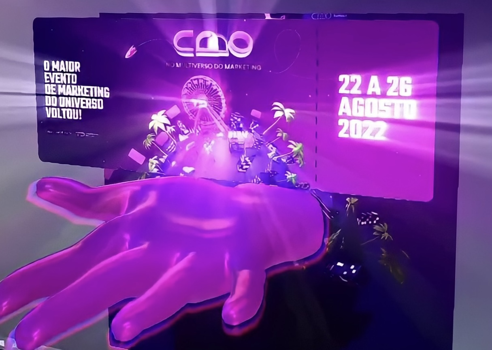

# Realidade Aumentada

export const Highlight = ({children, color}) => (
  
    {children}
  
);

Desde 2019, desenvolvo experiências em <Highlight color="#1877F2">Realidade Aumentada</Highlight> para redes sociais como Instagram, TikTok e Snapchat. Meus principais trabalhos são autorais ou para empresas/eventos.

## CMO Summit - AR Ticket

Junto com a VerseX, desenvolvi um ingresso em realidade aumentada para o evento CMO Summit, um dos maiores eventos online de Marketing no mundo. Após a inscrição, o usuário podia escanear o ingresso e ter uma experiência imersiva. 

Mais informações no [link](https://www.instagram.com/p/Cg2MO7uu08G/?utm_source=ig_web_button_share_sheet&igsh=MzRlODBiNWFlZA==).

## Web Summit Rio - Target Tracking

Para a VerseX, que esteve presente no evento Web Summit no Rio de Janeiro, desenvolvi um cartão de visita em Realidade Aumentada. 

Mais informações no [link](https://www.instagram.com/reel/CsEmOWpOBb1/?utm_source=ig_web_button_share_sheet&igsh=MzRlODBiNWFlZA==).

## Corteva - Hand Tracking

Junto com a VerseX, ideia foi desenvolver uma experiência "hand tracking", uma solução que cria uma interação em realidade aumentada na mão do usuário. Desse jeito, os participantes puderam ver com detalhes e de forma inovadora, a história sendo contada em sua mão.

O objetivo foi criar uma experiência que contasse a história do novo produto Utrisha N da Corteva para os produtores, saindo do padrão dos vídeos corporativos e utilizando a realidade aumentada para criar essa interação diferente no evento. 

Mais informações em [Como usamos a realidade aumentada para gerar mais valor para um evento](https://www.versex.com.br/pt/post/como-usamos-a-realidade-aumentada-para-gerar-mais-valor-para-um-evento).

## Outros

Além de empresas/eventos, já criei efeitos autorais com inspirações em jogos, albuns, séries e filmes como Cyberpunk 2077, Stranger Things, WandaVision, Loki e mais. Alguns estão disponíveis em meu [instagram](https://www.instagram.com/alencarhub/).